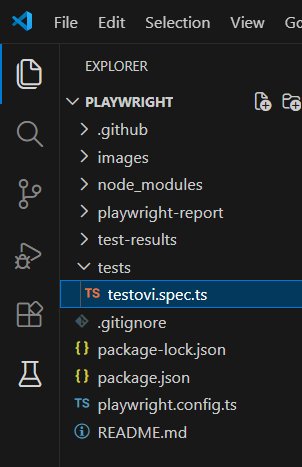
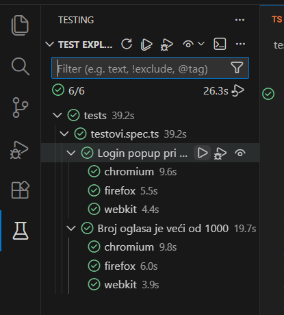

# Testovi za sajt KupujemProdajem

**Testirane funkcionalnosti:**
- Pretraga oglasa koji zadovoljavaju određene kriterijume. Potrebno je ustanoviti da takvih oglasa ima više od 1000. 
Kriterijumi su: kategorija "Odeća | Ženska", grupa "Bluze", cena od 100 din, samo sa cenom, stanje "Novo" i "Kao novo (nekorišćeno)".
Napomena: kategorija "Kao novo (nekorišćeno)" je preimenovana u "Nekorišćeno (polovno)" pa je korišćena ta kategorija.
- Pokušaj dodavanja korisnika koji je postavio oglas u adresar sa stranice oglasa. Trebalo bi da se otvori forma za login, pošto korisnik nije ulogovan.  

Tehnologije koje su korišćene: Playwright (TypeScript)  
Program u kome je rađen: Visual Studio Code  

## Uputstvo za pokretanje testa (Visual Studio Code)
**Preduslov**: Playwright ekstenzija je instalirana
1. Otvoriti folder testa u Visual Studio Code  
  
2. Kliknuti na "Testing" ikonicu u meniju sa leve strane (u obliku laboratorijske boce)  
   
3. Kliknuti na ikonicu "Run Test" pored željenog testa/željenih testova (u obliku "play" trougla)
  

## Rezultati testiranja

